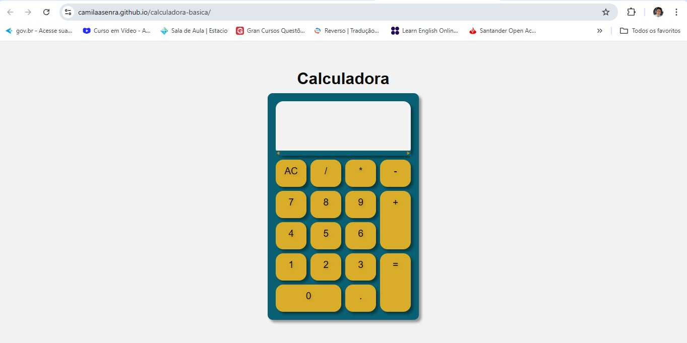

# 🧮 Calculadora Simples JS

 

> Uma calculadora funcional, simples e estilosa desenvolvida para realizar operações matemáticas básicas. Este projeto foi criado para praticar manipulação de DOM, lógica de programação com JavaScript, utilização de funções e condicionais. Também foi utilizado para praticar a utilização de gridlayout e flexbox com CSS3.

## ✨ Funcionalidades
- [x] Adição, Subtração, Multiplicação e Divisão.
- [x] Limpeza de tela (Clear).
- [x] Suporte a números decimais.
- [x] Responsividade (funciona no mobile).

## 🛠️ Tecnologias Utilizadas
- HTML5
- CSS3 (Flexbox/Grid)
- JavaScript (ES6)

## 🚀 Como Executar o Projeto

1. Faça o clone do repositório:
   `git clone https://github.com/CamilaASenra/calculadora-basica`
2. Abra o arquivo `index.html` no seu navegador.

## 🤝 Contribuições
Contribuições são bem-vindas! Sinta-se à vontade para abrir uma issue ou fazer um pull request.

## 📝 Licença
Este projeto está sob a licença MIT.
